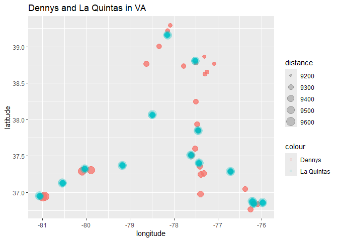

Lab 05 - La Quinta is Spanish for next to Denny’s, Pt. 2
================
Hannah Crawley
2.11.25

### Load packages and data

``` r
library(tidyverse) 
library(dsbox) 
```

``` r
states <- read_csv("data/states.csv")
```

### Exercise 1

> Filter the Denny’s data frame for Alaska (AK) and save the result as
> dn_ak. How many Denny’s locations are there in Alaska?

3 Dennys

``` r
dn_ak <- dennys %>% 
  filter(state == "AK")
nrow(dn_ak)
```

    ## [1] 3

> Now, do the same for La Quinta data frame for Alaska (AK) and save the
> result as lq_ak. How many La Quinta locations are there in Alaska?

2 La Quintas

``` r
lq_ak <- laquinta %>% 
  filter(state == "AK")
nrow(lq_ak)
```

    ## [1] 2

### Exercise 2

> Next we will be calculating the distance between all Denny’s and all
> La Quinta locations in Alaska.

> How many pairings are there between all Denny’s and all La Quinta
> locations in Alaska, i.e., how many distances do we need to calculate
> between the locations of these establishments in Alaska? Calculate the
> number of pairings using the data frames you have already made

We will need to calculate 6 different distances (2x3)

### Exercise 3

> In order to calculate these distances, we need to first restructure
> our data to pair the Denny’s and La Quinta locations. To do so, we
> will join the two data frames. We have six join options in R. Each of
> these join functions take at least three arguments: x, y, and by.  
> x and y are data frames to join by is the variable(s) to join by

Four of these join functions combine variables from the two data frames:

Note: These functions are called mutating joins.

inner_join(): return all rows from x where there are matching values in
y, and all columns from x and y.

left_join(): return all rows from x, and all columns from x and y. Rows
in x with no match in y will have NA values in the new columns.

right_join(): return all rows from y, and all columns from x and y. Rows
in y with no match in x will have NA values in the new columns.

full_join(): return all rows and all columns from both x and y, where
there are not matching values, returns NA for the one missing.

``` r
dn_lq_ak <- full_join(dn_ak, lq_ak, by = "state")
```

    ## Warning in full_join(dn_ak, lq_ak, by = "state"): Detected an unexpected many-to-many relationship between `x` and `y`.
    ## ℹ Row 1 of `x` matches multiple rows in `y`.
    ## ℹ Row 1 of `y` matches multiple rows in `x`.
    ## ℹ If a many-to-many relationship is expected, set `relationship =
    ##   "many-to-many"` to silence this warning.

``` r
dn_lq_ak
```

    ## # A tibble: 6 × 11
    ##   address.x     city.x state zip.x longitude.x latitude.x address.y city.y zip.y
    ##   <chr>         <chr>  <chr> <chr>       <dbl>      <dbl> <chr>     <chr>  <chr>
    ## 1 2900 Denali   Ancho… AK    99503       -150.       61.2 3501 Min… "\nAn… 99503
    ## 2 2900 Denali   Ancho… AK    99503       -150.       61.2 4920 Dal… "\nFa… 99709
    ## 3 3850 Debarr … Ancho… AK    99508       -150.       61.2 3501 Min… "\nAn… 99503
    ## 4 3850 Debarr … Ancho… AK    99508       -150.       61.2 4920 Dal… "\nFa… 99709
    ## 5 1929 Airport… Fairb… AK    99701       -148.       64.8 3501 Min… "\nAn… 99503
    ## 6 1929 Airport… Fairb… AK    99701       -148.       64.8 4920 Dal… "\nFa… 99709
    ## # ℹ 2 more variables: longitude.y <dbl>, latitude.y <dbl>

### Exercise 4

> How many observations are in the joined dn_lq_ak data frame? What are
> the names of the variables in this data frame.

Number of observations: 6

Variables: address.x city.x, state, zip.x, longitude.x, latitude.x
address.y city.y, zip.y, longitude.y, latitude.y

> .x in the variable names means the variable comes from the x data
> frame (the first argument in the full_join call, i.e. dn_ak), and .y
> means the variable comes from the y data frame. These variables are
> renamed to include .x and .y because the two data frames have the same
> variables and it’s not possible to have two variables in a data frame
> with the exact same name.

> Now that we have the data in the format we wanted, all that is left is
> to calculate the distances between the pairs.

### Exercise 5

> What function from the tidyverse do we use the add a new variable to a
> data frame while keeping the existing variables?

MUTATE!

### Exercise 6

> Calculate the distances between all pairs of Denny’s and La Quinta
> locations and save this variable as distance. Make sure to save this
> variable in THE dn_lq_ak data frame, so that you can use it later.

``` r
haversine <- function(long1, lat1, long2, lat2, round = 3) {
  # convert to radians
  long1 <- long1 * pi / 180
  lat1 <- lat1 * pi / 180
  long2 <- long2 * pi / 180
  lat2 <- lat2 * pi / 180

  R <- 6371 # Earth mean radius in km

  a <- sin((lat2 - lat1) / 2)^2 + cos(lat1) * cos(lat2) * sin((long2 - long1) / 2)^2
  d <- R * 2 * asin(sqrt(a))

  return(round(d, round)) # distance in km
}
```

``` r
dn_lq_ak_distance <-  dn_lq_ak%>%
  mutate(
    distance = haversine(lat1 = latitude.x, long1 = longitude.x, lat2 = latitude.y, long2 = latitude.y)
  )
```

### Exercise 7

> Calculate the minimum distance between a Denny’s and La Quinta for
> each Denny’s location. To do so we group by Denny’s locations and
> calculate a new variable that stores the information for the minimum
> distance.

``` r
dn_lq_ak_min <- dn_lq_ak_distance %>%
  group_by(address.x) %>%
  summarize(closest = min(distance))
```

### Exercise 8

> Describe the distribution of the distances Denny’s and the nearest La
> Quinta locations in Alaska. Also include an appropriate visualization
> and relevant summary statistics.

``` r
datasum_ak <- dn_lq_ak_distance %>% 
  summarise(
    mean_distance = mean(distance, na.rm = TRUE),
    max_distance = max(distance, na.rm = TRUE),
    min_distance = min(distance, na.rm = TRUE),
    count = n()
  )
print(datasum_ak)
```

    ## # A tibble: 1 × 4
    ##   mean_distance max_distance min_distance count
    ##           <dbl>        <dbl>        <dbl> <int>
    ## 1         5813.        6152.        5358.     6

``` r
library(tidyverse)
```

``` r
dn_lq_ak_distance %>% ggplot() + 
  geom_jitter(aes(x =  longitude.x, y = latitude.x, color = "Dennys", size = distance), alpha = .5) +
  geom_jitter(aes(x =  longitude.y, y = latitude.y, color = "La Quintas", size = distance), alpha = .5) + 
  labs(title = "Dennys and La Quintas in AK", y = "latitude", x = "longitude")
```

<!-- -->

### Exercise 9

> Repeat the same analysis for North Carolina: (i) filter Denny’s and La
> Quinta Data Frames for NC, (ii) join these data frames to get a
> complete list of all possible pairings, (iii) calculate the distances
> between all possible pairings of Denny’s and La Quinta in NC, (iv)
> find the minimum distance between each Denny’s and La Quinta location,
> (v) visualize and describe the distribution of these shortest
> distances using appropriate summary statistics.

``` r
dn_nc <- dennys %>% 
  filter(state == "NC")
nrow(dn_nc)
```

    ## [1] 28

``` r
lq_nc <- laquinta %>% 
  filter(state == "NC")
nrow(lq_nc)
```

    ## [1] 12

``` r
dn_lq_nc <- full_join(dn_nc, lq_nc, by = "state")
```

    ## Warning in full_join(dn_nc, lq_nc, by = "state"): Detected an unexpected many-to-many relationship between `x` and `y`.
    ## ℹ Row 1 of `x` matches multiple rows in `y`.
    ## ℹ Row 1 of `y` matches multiple rows in `x`.
    ## ℹ If a many-to-many relationship is expected, set `relationship =
    ##   "many-to-many"` to silence this warning.

``` r
dn_lq_nc
```

    ## # A tibble: 336 × 11
    ##    address.x    city.x state zip.x longitude.x latitude.x address.y city.y zip.y
    ##    <chr>        <chr>  <chr> <chr>       <dbl>      <dbl> <chr>     <chr>  <chr>
    ##  1 1 Regent Pa… Ashev… NC    28806       -82.6       35.6 165 Hwy … "\nBo… 28607
    ##  2 1 Regent Pa… Ashev… NC    28806       -82.6       35.6 3127 Slo… "\nCh… 28208
    ##  3 1 Regent Pa… Ashev… NC    28806       -82.6       35.6 4900 Sou… "\nCh… 28217
    ##  4 1 Regent Pa… Ashev… NC    28806       -82.6       35.6 4414 Dur… "\nDu… 27707
    ##  5 1 Regent Pa… Ashev… NC    28806       -82.6       35.6 1910 Wes… "\nDu… 27713
    ##  6 1 Regent Pa… Ashev… NC    28806       -82.6       35.6 1201 Lan… "\nGr… 27407
    ##  7 1 Regent Pa… Ashev… NC    28806       -82.6       35.6 1607 Fai… "\nCo… 28613
    ##  8 1 Regent Pa… Ashev… NC    28806       -82.6       35.6 191 Cres… "\nCa… 27518
    ##  9 1 Regent Pa… Ashev… NC    28806       -82.6       35.6 2211 Sum… "\nRa… 27612
    ## 10 1 Regent Pa… Ashev… NC    28806       -82.6       35.6 1001 Aer… "\nMo… 27560
    ## # ℹ 326 more rows
    ## # ℹ 2 more variables: longitude.y <dbl>, latitude.y <dbl>

``` r
dn_lq_nc_distance <-  dn_lq_nc %>%
  mutate(
    distance = haversine(lat1 = latitude.x, long1 = longitude.x, lat2 = latitude.y, long2 = latitude.y)
  )
```

``` r
dn_lq_nc_min <- dn_lq_nc_distance %>%
  group_by(address.x) %>%
  summarize(closest = min(distance))
```

``` r
datasum_nc <- dn_lq_nc_distance %>% 
  summarise(
    mean_distance = mean(distance, na.rm = TRUE),
    max_distance = max(distance, na.rm = TRUE),
    min_distance = min(distance, na.rm = TRUE),
    count = n()
  )
print(datasum_nc)
```

    ## # A tibble: 1 × 4
    ##   mean_distance max_distance min_distance count
    ##           <dbl>        <dbl>        <dbl> <int>
    ## 1         9654.        9855.        9483.   336

``` r
dn_lq_nc_distance %>% ggplot() + 
  geom_jitter(aes(x =  longitude.x, y = latitude.x, color = "Dennys", size = distance), alpha = .1) +
  geom_jitter(aes(x =  longitude.y, y = latitude.y, color = "La Quintas", size = distance), alpha = .1) + 
  labs(title = "Dennys and La Quintas in NC", y = "latitude", x = "longitude")
```

<!-- -->

### Exercise 10

> Repeat the same analysis for Texas.

``` r
dn_tx <- dennys %>% 
  filter(state == "TX")
nrow(dn_tx)
```

    ## [1] 200

``` r
lq_tx <- laquinta %>% 
  filter(state == "TX")
nrow(lq_tx)
```

    ## [1] 237

``` r
dn_lq_tx <- full_join(dn_tx, lq_tx, by = "state")
```

    ## Warning in full_join(dn_tx, lq_tx, by = "state"): Detected an unexpected many-to-many relationship between `x` and `y`.
    ## ℹ Row 1 of `x` matches multiple rows in `y`.
    ## ℹ Row 1 of `y` matches multiple rows in `x`.
    ## ℹ If a many-to-many relationship is expected, set `relationship =
    ##   "many-to-many"` to silence this warning.

``` r
dn_lq_tx
```

    ## # A tibble: 47,400 × 11
    ##    address.x    city.x state zip.x longitude.x latitude.x address.y city.y zip.y
    ##    <chr>        <chr>  <chr> <chr>       <dbl>      <dbl> <chr>     <chr>  <chr>
    ##  1 120 East I-… Abile… TX    79601       -99.6       32.4 3018 Cat… "\nAb… 79606
    ##  2 120 East I-… Abile… TX    79601       -99.6       32.4 3501 Wes… "\nAb… 79601
    ##  3 120 East I-… Abile… TX    79601       -99.6       32.4 14925 La… "\nAd… 75254
    ##  4 120 East I-… Abile… TX    79601       -99.6       32.4 909 East… "\nAl… 78516
    ##  5 120 East I-… Abile… TX    79601       -99.6       32.4 2400 Eas… "\nAl… 78332
    ##  6 120 East I-… Abile… TX    79601       -99.6       32.4 1220 Nor… "\nAl… 75013
    ##  7 120 East I-… Abile… TX    79601       -99.6       32.4 1165 Hwy… "\nAl… 76009
    ##  8 120 East I-… Abile… TX    79601       -99.6       32.4 880 Sout… "\nAl… 77511
    ##  9 120 East I-… Abile… TX    79601       -99.6       32.4 1708 Int… "\nAm… 79103
    ## 10 120 East I-… Abile… TX    79601       -99.6       32.4 9305 Eas… "\nAm… 79118
    ## # ℹ 47,390 more rows
    ## # ℹ 2 more variables: longitude.y <dbl>, latitude.y <dbl>

``` r
dn_lq_tx_distance <-  dn_lq_tx %>%
  mutate(
    distance = haversine(lat1 = latitude.x, long1 = longitude.x, lat2 = latitude.y, long2 = latitude.y)
  )
```

``` r
dn_lq_tx_min <- dn_lq_tx_distance %>%
  group_by(address.x) %>%
  summarize(closest = min(distance))
```

``` r
datasum_tx <- dn_lq_tx_distance %>% 
  summarise(
    mean_distance = mean(distance, na.rm = TRUE),
    max_distance = max(distance, na.rm = TRUE),
    min_distance = min(distance, na.rm = TRUE),
    count = n()
  )
print(datasum_nc)
```

    ## # A tibble: 1 × 4
    ##   mean_distance max_distance min_distance count
    ##           <dbl>        <dbl>        <dbl> <int>
    ## 1         9654.        9855.        9483.   336

``` r
dn_lq_tx_distance %>% ggplot() + 
  geom_jitter(aes(x =  longitude.x, y = latitude.x, color = "Dennys", size = distance), alpha = .1) +
  geom_jitter(aes(x =  longitude.y, y = latitude.y, color = "La Quintas", size = distance), alpha = .1) + 
  labs(title = "Dennys and La Quintas in TX", y = "latitude", x = "longitude")
```

<!-- -->

### Exercise 11

> Repeat the same analysis for a state of your choosing, different than
> the ones we covered so far. (VA)

``` r
dn_va <- dennys %>% 
  filter(state == "VA")
nrow(dn_va)
```

    ## [1] 28

``` r
lq_va <- laquinta %>% 
  filter(state == "VA")
nrow(lq_va)
```

    ## [1] 14

``` r
dn_lq_va <- full_join(dn_va, lq_va, by = "state")
```

    ## Warning in full_join(dn_va, lq_va, by = "state"): Detected an unexpected many-to-many relationship between `x` and `y`.
    ## ℹ Row 1 of `x` matches multiple rows in `y`.
    ## ℹ Row 1 of `y` matches multiple rows in `x`.
    ## ℹ If a many-to-many relationship is expected, set `relationship =
    ##   "many-to-many"` to silence this warning.

``` r
dn_lq_va
```

    ## # A tibble: 392 × 11
    ##    address.x    city.x state zip.x longitude.x latitude.x address.y city.y zip.y
    ##    <chr>        <chr>  <chr> <chr>       <dbl>      <dbl> <chr>     <chr>  <chr>
    ##  1 7214 Richmo… Alexa… VA    22306       -77.1       38.8 1803 Emm… "\nCh… 22901
    ##  2 7214 Richmo… Alexa… VA    22306       -77.1       38.8 3320 Can… "\nLy… 24502
    ##  3 7214 Richmo… Alexa… VA    22306       -77.1       38.8 6950 Nov… "\nMa… 20109
    ##  4 7214 Richmo… Alexa… VA    22306       -77.1       38.8 1387 Nor… "\nNo… 23502
    ##  5 7214 Richmo… Alexa… VA    22306       -77.1       38.8 192 Newt… "\nVi… 23462
    ##  6 7214 Richmo… Alexa… VA    22306       -77.1       38.8 1450 Tyl… "\nRa… 24141
    ##  7 7214 Richmo… Alexa… VA    22306       -77.1       38.8 1301 Hug… "\nMi… 23113
    ##  8 7214 Richmo… Alexa… VA    22306       -77.1       38.8 16280 In… "\nDo… 23047
    ##  9 7214 Richmo… Alexa… VA    22306       -77.1       38.8 9040 Pam… "\nRi… 23237
    ## 10 7214 Richmo… Alexa… VA    22306       -77.1       38.8 140 Sher… "\nSa… 24153
    ## # ℹ 382 more rows
    ## # ℹ 2 more variables: longitude.y <dbl>, latitude.y <dbl>

``` r
dn_lq_va_distance <-  dn_lq_va %>%
  mutate(
    distance = haversine(lat1 = latitude.x, long1 = longitude.x, lat2 = latitude.y, long2 = latitude.y)
  )
```

``` r
dn_lq_va_min <- dn_lq_va_distance %>%
  group_by(address.x) %>%
  summarize(closest = min(distance))
```

``` r
datasum_va <- dn_lq_va_distance %>% 
  summarise(
    mean_distance = mean(distance, na.rm = TRUE),
    max_distance = max(distance, na.rm = TRUE),
    min_distance = min(distance, na.rm = TRUE),
    count = n()
  )
print(datasum_va)
```

    ## # A tibble: 1 × 4
    ##   mean_distance max_distance min_distance count
    ##           <dbl>        <dbl>        <dbl> <int>
    ## 1         9330.        9615.        9190.   392

``` r
dn_lq_va_distance %>% ggplot() + 
  geom_jitter(aes(x =  longitude.x, y = latitude.x, color = "Dennys", size = distance), alpha = .1) +
  geom_jitter(aes(x =  longitude.y, y = latitude.y, color = "La Quintas", size = distance), alpha = .1) + 
  labs(title = "Dennys and La Quintas in VA", y = "latitude", x = "longitude")
```

<!-- --> \###
Exercise 12

> Among the states you examined, where is Mitch Hedberg’s joke most
> likely to hold true? Explain your reasoning.

AK: If you are at a La Quintas you could find a Dennys within a short
drive

NC: La Quintas does mean next to Dennys, but Dennys does not mean next
to La Quintas

TX: Texas is plagued with La Quintas and Dennys

VA: If you are in a La Quintas you are very likely to be next to a
Dennys

The joke is most likely to hold true in TX!
